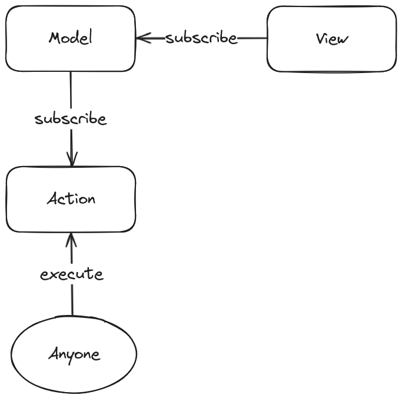

# Frontend. MVA архитектура

Здравствуйте.

Из этой статьи вы узнаете об определенном архитектурном подходе, который я назвал **MVA**.

Вы, возможно, узнаете в данном подходе **Flux** или **MVI**, но я считаю, что это что-то другое. Почему - я опишу позже.

****

## Введение

Для начала давайте подумаем о том из чего состоят наши приложения.

1. Данные
2. Представление
3. Логика

Мы берем данные и показываем их. Выполняем какие-то действия, меняем данные и опять показываем.
Подгружаем данные, показываем. Пользователь нажал на кнопку, выполнил действие, данные поменялись, показали.

Всё просто, казалось бы, но когда мы начинаем это реализовывать - возникают сложности.

Логика зачем-то разбросана по разным компонентам, частям проекта, данные тоже хранятся то там, то там, компоненты не
переиспользуемы из-за внутренних зависимостей итд.

Если вы не задумались об архитектуре, о структуре, о принципах проекта в самом начале - вас ждут боль и выгорание.
Любое изменение, добавление нового, удаление старого, будут даваться с болью и в конце концов появляется желание "Надо
все переписать".

Существует множество готовых архитектурных решений и каждое решает свою задачу. И я тоже не предлагаю ультимативное
решение на все случаи жизни, но это действительно ультимативно-простой подход направленный именно на удобство
использования и понимание того что и когда происходит в вашем проекте.

Так давайте разберемся.

****

## Сущности и поток данных



1. Model - хранит данные
2. View - представление данных
3. Action - какое-либо действие

Пока я ничего не объяснил - скорее всего ничего не понятно, так что давайте по порядку.

### `View -> subscribe -> Model`

Представление просто подписывается на изменения в модели и рендерит их. Это всё. Буквально всё.

### `Model -> subscribe -> Action`

Модель подписывается на действия и в зависимости от их вызова меняет себя. Никто не меняет модель кроме самой себя.

Например, у нас есть действие `Загрузить список постов`. Мы вызываем его и модель, увидев это, меняет свое состояние на
состояние ожидания, а после завершения действия - на состояние готовности.

### `Anyone -> execute -> Action`

Кто угодно вызывает какие угодно действия.

## Сущности

Теперь давайте подробно и с примерами разберем сущности.

### Action

Для начала давайте разберем что такое `Action`.

Это может быть абсолютно любое действие, например: "Ввод логина", "Загрузить посты", "Отправить комметарий".

```typescript
// "Ввод логина"
export const enterLogin = (login: string) => {
    if (isValidLogin(login)) {
        return true;
    } else {
        throw new Error('Логин введен не верно');
    }
};

// "Загрузить посты"
export const getPosts = (userId: string, limit: number) =>
    fetch(`${ __API__ }/v1/posts/user/${ userId }?limit=${ limit }`)
        .then((response) => response.json());

// "Отправить комметарий"
export const sendComment = (postId: string, comment: string) =>
    fetch(`${ __API__ }/v1/comment/${ postId }`, { method: 'POST', body: comment })
        .then((response) => response.json());

// Я намеренно упрощаю максимально код, чтобы это не отвлекало, потому что это не важно.
```

То есть это просто какая-то функция которая просто что-то делает своё. Она не зависит от контекста в котором она
выполняется, она ... TODO

### Model

Как у нас будет выглядеть модель?

```typescript
// Создаем хранилища
const postsIsPending: boolean = store<boolean>(false);
const postsList: Array<Post>  = store<Array<Post>>([]);
```

... TODO
