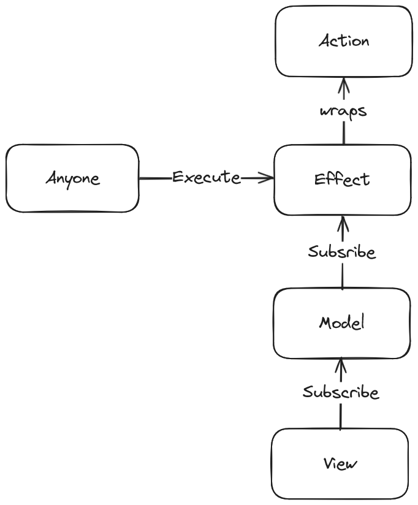

# Frontend. MVA архитектура

Здравствуйте.

Из этой статьи вы узнаете об определенном архитектурном подходе, который я назвал **MVA**.

Вы, возможно, узнаете в данном подходе **Flux** или **MVI**, но я считаю, что это что-то другое. Почему - вы узнаете
дальше.

На самом деле не важно как это всё называется, придумал ли я что-то новое или нет.

Я пришел к определенному архитектурному подходу и сам для себя его назвал **MVA**. После решил поискать нечто подобное и
точно такого же не нашел. Решил поделиться, потому что считаю его очень удобным и простым.

Эта статья является расширением/продолжением [прошлой статьи](https://habr.com/ru/articles/824842/), которую, как мне
кажется, многие не поняли. Если вы дочитаете эту статью до конца и заинтересуетесь - советую прочесть и прошлую, для
лучшего понимания.

Так же весь код считайте псевдокодом.

****

## План

1. Предисловие
2. Архитектура MVA
3. Отличия от других архитектур
4. Плюсы / Минусы
5. Инструменты
6. Вариант реализации
7. Ссылки на примеры
8. Итог

## Предисловие

Перед тем как начать, важно понимать пару вещей которые я для себя решил считать верными и следую им.

1.

Архитектуры, библиотеки, фреймворки, принципы, тестирование, итд. - это инструменты и у каждого есть своя область
применения, свои плюсы и минусы, своя цена итд.

- Какие-то инструменты много весят, но дают большой функционал.
- Какие-то дают вам удобство, но забирают производительность.
- Какие-то ограничивают вас, но делают проект легко изменяемым.
- Какие-то забирают больше времени, но делают так что проект не умрет через день.
- итд.

И каждый инструмент нужен тогда когда нужен именно такой инструмент. Как бы это очевидно не звучало.

2.

Так же я всегда стараюсь всё максимально упростить с точки зрения абстрактности, чтобы уместить приложение в голове
целиком, каким бы большим оно не было.

Сделать сложно - очень просто, но сделать просто - очень сложно.

****

## Архитектура MVA

**MVA** это способ организации кода который предполагает выделение трех сущностей и связи между ними.

1. **Model** - хранилище данных с самообновлением
2. **View** - представление данных с самообновлением
3. **Action** - самодостаточное действие



Что такое **Effect** - узнаем чуть дальше.

### Сущности

Разберем каждую сущность по отдельности и определим их задачи.

#### Model

Вся задача **Model** сводится к тому, чтобы подписаться на действия и самообновляться.

То есть никто кроме самой **Model** не может обновить её или вызвать какое-то обновление.

Например:

```typescript

// При вызове действия getPosts - состояние само обновится на true, а при его окончании на false
const $postsIsPending = store<boolean>(false)
    .on(getPosts, 'onBefore', () => true)
    .on(getPosts, 'onFinally', () => false);

```

#### View

Задача **View** сводится к рендеру данных и вызову действий.

Для удобства так же разделяем **View** на [два типа компонентов](https://habr.com/ru/articles/784172/) одни из которых
(shared, entity) ни от чего не зависят, а вторые (feature, widget) уже и подписываются на **Model** и вызывают
**Effect**.

Пример виджета:

```typescript jsx

import { FC, memo } from 'react';


export const Posts: FC = memo(function Posts () {
    const postsIsPending = useStore($postsIsPending);
    const postsList      = useStore($postsList);

    return (
        <section>
            <h2>Posts</h2>
            {
                postsIsPending ? <Loader/> : <PostsList list={ postsList }/>
            }
        </section>
    );
});

```

#### Action

Что такое действия? Действия могут быть чем угодно. Это может быть:

- Функция входа в аккаунт `signIn (login: string, password: string): Promise<AuthData>`
- Функция загрузки постов `getPosts (userId: string, options: SearchOptions): Promise<Array<Post>>`
- Функция, чтобы оставить комментарий `sendCommentary (postId: string, commentary: string): Promise<Commentary>`
- итд.

Например:

```typescript

const getPosts = function (userId: string): Promise<Array<Post>> {
    return fetch(`${ __API__ }/v1/posts/user/${ userId }`, { method: 'GET' })
        .then((response) => response.json());
};

```

****

В итоге мы имеем три разные сущности которые, по сути, могут независимо (почти) разрабатываться разными людьми и
тестироваться. Единственное, что при разработке моделей нужно знать сигнатуры действий, ведь мы будем на них
подписываться из модели и нам нужно понимать какие данные откуда мы можем получить, но типы действий можно выделить
сразу.

### Связи

Теперь разберем как связаны эти сущности друг с другом.

#### **View** -> **Model**

**View** подписывается на **Model**, отслеживает изменения и самообновляется.

В примере выше это было сделано через хук `useState`, а самообновление происходит самим условным *React*

#### **Model** -> **Effect**

**Effect** это обертка над **Action**. Эта обертка сохраняет сигнатуру, а так же создает независимый экземпляр функции
на которую можно подписаться из **Model**. Почему так? Почему бы не подписываться сразу на **Action**?

Допустим у нас есть **Action** `getUser (userId: string): Promise<User>`. Это действие мы можем хотеть использовать во
многих местах нашего приложения. Например, для получения данных для рендера главной страницы пользователя или же для
получения данных для показа их в выпадающем окне при наведении итд. И для этих задач у нас будут созданы две разные
модели, одна для главной страницы, одна для выпадающего окна. Но обе они будут подписаны на одно и тоже. Получается, что
при вызове этого действия - обновляться будут обе модели, а мы, скорее всего, этого не хотим.

По этому мы создаем **Effect**-ы (обертку над **Action**)

```typescript
const getUserPageData    = effect(getUser);
const getUserPopOverData = effect(getUser);
```

Получаем один и тот же функционал, но разные эффекты, а следовательно проблемы с тем, что модель будет обновляться
тогда когда не нужно - не будет.

Как раз таки на этот **Effect** мы и подписывались в примере в **Model** выше.

```typescript
// При вызове действия getPosts - состояние само обновится на true, а при его окончании на false
const $postsIsPending = store<boolean>(false)
    .on(getPosts, 'onBefore', () => true)
    .on(getPosts, 'onFinally', () => false);
```

#### **Effect** -> **Action**

Это собственно обертка над **Action** которая служит для того о чем мы говорили до.

```typescript
const getUserPageData    = effect(getUser);
const getUserPopOverData = effect(getUser);
```

## Отличия от других архитектур

Теперь разберем отличия от **Flux**, **MVI** и допустим **MVC**.

Ps. Читая про разные архитектуры, про их суть, можно часто заметить, что разные люди, разные источники, трактуют их по
своему. Но как мне кажется, я понял их суть и я буду отталкиваться от своего понимания, которое, разумеется, может быть
отличным от вашего или вовсе не верным.

### Flux

С **Flux** вообще интересно, потому что они вроде бы похожи, но вообще разные.
И там и там однонаправленный поток данных (в чем похожи), но реализация архитектуры - разная.
Основное отличие от **Flux** это отсутствие *Dispatcher*.

Тут, для меня, действительно сложно, потому что в зависимости от того как посмотреть - она может быть то похожа, то
совсем другой. Но главным аргументом для меня в пользу того, что они разные - является то, что если попробовать
перенести то как делаю я в **MVA** на **Flux** - получается всё гораздо сложнее и не понятно зачем.

Тут нужно попробовать применить этот подход и самому почувствовать разницу.

### MVI

С **MVI** достаточно просто. Там я нашел 2 варианта трактовки и оба они отличаются от **MVA**.

1. Действия (Intent) в **MVI** сами обновляют модель. Модель не подписывается на действия.
2. Действия (Intent) в **MVI** сами отправляют данные в модель которые та уже сама как-то обновляет. Модель не
   подписывается на действия.

В **MVA** только модель может себя обновить и обновление вызывается по вызову какого-то **Effect**.

### MVC

Казалось бы, причем тут **MVC**? Но под прошлой статьй на эту же тему кто-то написал, про "Опять изобрели MVC" и на
всякий случай разберем и это.

В **MVC** всем рулит *Controller*. Он является связью между *View* и *Model*. Опять же, можно всё трактовать по-разному.
Где-то вы прочтете, что *Controller* контролирует только *Model*, а *View* на его подписывается, кто-то допускает связь
между *View* и *Model* на прямую итд.

В **MVA** никто никем не рулит.

- **View** напрямую подписывается на **Model** и самообновляется.
- **Model** подписывается на **Effect** и самообновляется.
- **Action** просто существуют.

## Плюсы / Минусы

Ps. Тут приведет не весь список, а только важные моменты.

### Плюсы

Основной плюс подхода - его простота.

1. Благодаря простой структуре можно легко понимать устройство всего приложения целиком вне зависимости от его размера.
2. Так как вам нужно совсем маленькое количество функционала для реализации архитектуры - вам не нужны тяжеловесные
   реализации глобальных хранилищ, но об этом чуть позже.
3. Вы почти не пишите лишнего кода, кроме создания эффектов, подписок, но это зависит от реализации. (`effect`, `on`)
4. Разделение кода позволяет разрабатывать и тестировать части приложения отдельно друг от друга. (кроме того момента,
   что для подписок **Model** нужно знать сигнатуры **Action**, но их можно определить заранее).

### Минусы

Буквально не обнаружено ни одного.

## Инструменты

Я не просто так писал в предисловии как отношусь к инструментам и что всё есть инструмент.

У нас есть задача реализовать данную архитектуру, что нам нужно?

1. **View** должен самообновляться по подписке на **Model**
2. **Model** должен самообновляться по подписке на **Effect**
3. У нас должна быть возможность создавать **Effect** на основе **Action**

А теперь начинаем искать готовые решения. (это разумеется не все возможные, а просто несколько примеров).

### Model

Нам нужно хранилище способное подписываться на действия, какие варианты?

1. Redux + Thunk-и
2. Effector

#### Redux + Thunk

Да, мы создаем Thunk-и.

Например:

```typescript
export const getPostsThunk = createAsyncThunk<Array<Post>, string, ThunkApi>(
    'posts/getPosts',
    async (userId, thunkApi) => {
        try {
            return await getPosts(userId);
        } catch (e: unknown) {
            return thunkAPI.rejectWithValue(e);
        }
    },
);
```

А дальше подписываемся через `extraReducers` в слайсах.

```typescript
const initialState: PostsSchema = {
    isPending: false,
    error    : null,
    list     : [],
};

export const postsSlice = createSlice({
    name         : 'posts',
    initialState : initialState,
    reducers     : {},
    extraReducers: (builder) => {
        builder.addCase(getPostsThunk.fulfilled, (state, action) => {
            state.isPending = false;
            state.error     = null;
            state.list      = action.payload;
        });
        builder.addCase(getPostsThunk.pending, (state) => {
            state.isPending = true;
            state.error     = null;
        });
        builder.addCase(getPostsThunk.rejected, (state, action) => {
            state.isPending = false;
            state.error     = action.payload ?? {
                code   : 500,
                message: 'Unknown error',
            };
            state.list      = [];
        });
    },
});
```

Мы получили то что и хотели? Получили.

Но, а теперь давайте подумаем. Вот мы, получается, для реализации этой архитектуры, для которой нужно совсем не много,
используем целый Redux и добавляем целые 15 кб (в gzip) к бандлу ради небольшой части Redux-а. Слишком много. Не
подходит.

#### Effector

Тут всё просто. В *Effector* есть всё что нам нужно.

Создаем **Model**, создаем **Effect** и готово

```typescript
const getPostsEffect = createEffect(getPosts);

const $postsIsPending = createStore(false)
    .on(getPostsEffect, () => true)
    .on(getPostsEffect.finally, () => false);

const $postsError = createStore<Error>(null)
    .on(getPostsEffect.fail, ({ error }) => error);

const $postsList = createStore<Array<Post>>([])
    .on(getPostsEffect.done, ({ result }) => result);
```

Да, классно. *Effector* добавляет всего 4 кб (в gzip) к бандлу. Но и как в случае в *Redux*, он не нужен нам целиком, мы
не будем использовать всё что в нём есть. Не подходит.

****

Какие еще есть варианты? Да просто пишем свой стор с тремя функциями (`store`, `effect` и `combine`) и всё.
На сколько будет "умной" реализация вы уже сами для себя решаете. И вы добавите туда столько сколько именно вам для
вашей задачи нужно. Я написал [свою реализацию](https://github.com/vanyamate/sec) и на ней написал "социальную сеть".
Всё отлично работает и всего ~150 строчек вместе с типизацией.

Ps. Это не реклама, это я лишь показываю, что вам не обязательно тянуть в проект 15 кб, а можно написать свою реализацию
под конкретно ваши задачи. Но если вы понимаете что вам нужен именно Redux или Effector - вам никто не запрещает,
разумеется. Просто я не использую весь их функционал из-за того, что он просто не нужен.

Это всё равно что добавить `axios` в проект и просто делать им запросы как `fetch`-ем.

#### View

Давайте так же поговорим и про то что уже есть готовое для **View**. Возьмем несколько вариантов:

1. React
2. SolidJS
3. Svelte

Я не буду ничего расписывать про них, это не важно, но во всех этих (и многих других) инструментах мы можем реализовать
подписку на **Model** и они будут самообновляться. Просто выбирайте с умом.

Например, *React* добавляет к бандлу 40 кб (в gzip), а *SolidJS* всего 6 кб (в gzip), а *Svelte* так еще меньше. Тогда
почему *React*?

Так же они отличаются в производительности, в том насколько много уже готовых решений для решения ваших проблем, в том
на сколько их хорошо знают итд.

****

Допустим мы выбрали:

- React (40 kb gzip)
- Redux (15 kb gzip)
- Axios (15 kb gzip)

Мы еще не написали ни строчки кода, приложение уже весит 70 кб в gzip.

А допустим мы выбрали:

- SolidJS (6 kb gzip)
- Свою реализацию стора (500 b)
- Свою реализацию апишки для запросов (500 b)

В итоге мы имеем 7 кб в gzip. В 10 раз меньше. Я об этом.

Да, мы потратили больше времени, да, в SolidJS не так много готовых решений и в будущем, возможно, потратим еще время на
их реализацию. Стоит ли оно того? Решайте уже вы для себя. Просто подумайте об этом.

Я ничего не рекламирую и не агитирую за какое-то решение, я просто делюсь размышлениями.

## Вариант реализации

Тут я просто опишу то как я бы сейчас реализовал **MVA**.

Структура папок:

```
/src
   /action
      /[принадлежность]
         /[имя]
            name.action.ts
   /model
      /[принадлежность]
         /[имя]
            name.model.ts
   /ui
      /[тип компонента (shared, entity, feature, widget, page, layout, etc)]
         /[принадлежность]
            /[Имя]
               /[ui]
                  Component.module.css
                  Component.tsx(.svelte, .etc)
         
```

В качестве стора - написал бы своё решение в зависимости от задачи. Хочу попробовать позже написать на вебворкере, чтобы
расчеты нового состояния происходили именно там.

В качестве вьюшки - сложно, потому что я не писал ничего большого не на реакте, но пробовал с svelte и solid - мне
кажется, что выбрал бы что-то из них, а может что-то другое вообще.

## Ссылки на примеры

Примерно 2 месяца назад я открыл для себя такой подход и написал о нем [статью](https://habr.com/ru/articles/824842/).
Тогда еще не было чего-то большого написано полностью с таким подходом, теперь есть.

Все ссылки ведут на github.

1. Переписанная полностью на **MVA** ["Социальная сеть"](https://github.com/VanyaMate/product).
   Там и сообщения реализованы и посты и друзья и облачное хранилище и уведомлния и всякое другое, но суть в том, что в
   проекте используется **MVA** и всё легко разрабатывается. То есть до этого я что-то разрабатывал, разрабатывал и в
   какой-то момент начинались сложности, а тут всё идет так как будто это новый проект, хотя он уже достаточно большой.

Вы можете посмотреть сами как это можно реализовать (как это реализовал я) и что это такое.

- Модели лежат в `/src/app/model`
- Вьюшки в `/src/[type]`
- Действия в `/src/app/action`

Ps. Я понимаю, что там в моделях, по подпискам, одинаковые функции, что можно это сделать лучше, но это уже
детали реализации.

2. [Частично переписанный этот же проект](https://github.com/VanyaMate/product-svelte) на *Svelte* и *Effector*, сразу с
   использованием **MVA**
3. [Тудушка (React, своя реализация стора)](https://github.com/VanyaMate/todo-react-sec-test)
4. [Тудушка (Svelte, Effector)](https://github.com/VanyaMate/todo-svelte-effector-test)
5. [Тудушка (React, Effector)](https://github.com/VanyaMate/todo-react-effector-test)
6. [Тудушка (SolidJS, своя реализация стора)](https://github.com/VanyaMate/todo-solidjs-sec-test)

## Итог

Я искренне считаю, что это очень крутая архитектура. Очень простая.

Для её реализации нам не нужны какие-то громоздкие инструменты, она регламентирует поток данных в приложении, части
приложения легко разрабатываются параллельно.

Вам никто и ничто не мешает использовать этот подход вместе с другими.

Так же я советую, если вы не читали [прошлую статью](https://habr.com/ru/articles/824842/), прочесть и её и комментарии
под ней, думаю в таком случае будет больше понимания, что я хочу донести. Там больше примеров и больше именно в
прикладном смысле написано.

И я бы не писал вторую статью на эту тему если бы не считал, что это очень крутой подход. Просто мне кажется, что
прошлую статью не очень поняли и это, думаю, последняя попытка объяснить эту архитектуру.

****

Если у вас есть замечания / предложения / критика / вопросы и что угодно другое - то пишите в комментариях или в телегу
[@VanyaMate](https://t.me/VanyaMate)

Спасибо за внимание)