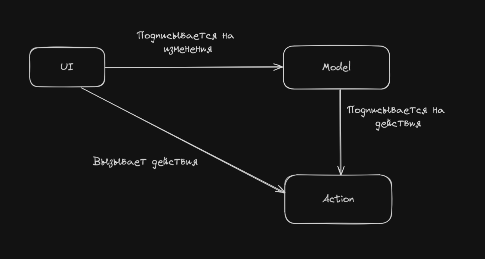

Здравствуйте :)

Коротко о чем тут, чтобы вы могли понять нужно ли оно вам или нет.

Тут я описываю то к чему пришел в проектировании глобальных сторов и потока данных в приложении.

Материал может быть полезен как для новичков, так и для более опытных.

Примеры будут на React и Effector, но это не важно, потому что тут важна идея, а не реализация. К тому же это везде
будет примерно одинаково выглядеть.
В конце будут так же ссылки на примеры с `svelte + effector` и `react + redux thunk`

Перед тем как это всё начать писать, я изучил похожие подходы и да, они есть.
Есть FLUX (там еще Dispatcher), MVI, может еще что-то.

Да, я опять не открыл Америку, но попытаюсь понятно объяснить свой подход и описать его плюсы.

И да, весь код дальше считайте псевдокодом, там могут быть ошибки, я писал его сюда сразу.
****

А теперь к сути. В чем идея?

Я предлагаю организовать весь поток данных не относящийся к UI таким образом:



- UI - подписывается на изменения Model и рендерит их.
- UI - вызывает Action.
- Model - подписывается на Action.

Что это значит?

- UI только рендерит данные и вызывает какие-то экшены.
- Model сама себя обновляет в зависимости от того какой экшен был вызван.

### Вариант реализации

Давайте представим такое простое приложение.
Допустим у нас есть:

1. Форма создания новой задачи
2. Список задач

Тогда нам нужно иметь, допустим, 3 поля:

1. Состояние добавления новой задачи (`Boolean`)
2. Состояние загрузки задач (`Boolean`)
3. Список задач (`Array<Todo>`)

Так же нам нужны будут 2 экшена:

1. Создать новую задачу (`createTodo`)
2. Получить список всех задач (`getTodos`)

И тут начинается самое интересное.

Давайте создадим эти Action-ы.

```typescript
// /action/todo/createTodo.ts
export const craeteTodo = function (title: string): Promise<Todo> {
    return fetch(`/api/v1/todo`, { method: 'POST', body: title })
        .then((response) => response.json());
};
```

```typescript
// /action/todo/getTodos.ts
export const getTodos = function (): Promise<Array<Todo>> {
    return fetch(`/api/v1/todo`, { method: 'GET' })
        .then((response) => response.json());
};
```

Отлично. Как вы видите это просто обычные функции, всё просто.

Теперь давайте создадим Model.

```typescript
// /model/todo/todo.model.ts

/* 
 * Для того чтобы связать action-ы с нашими сторами 
 * мы будем использовать createEffect из effector. 
 * Все сигнатуры фунций останутся, но теперь мы можем подписаться на них
 */
export const createTodoEffect = createEffect(craeteTodo);
export const getTodosEffect   = createEffect(getTodos);


/*
 * todoLoading - состояние загрузки списка задач
 * Что тут происходит?
 * Мы подписываемся на эффекты которые только что создали и:
 * Когда мы вызовем getTotosEffect - состояние изменится на true
 * Когда getTodosEffect выполнится - состояние поменяется на false
 * 
 * Таким образом можно подписываться на множество разных экшенов или на один и тот же,
 * но использовать разные состояния (done, fail, finally, ...)
 */
export const todoLoading = createStore<boolean>(false)
    .on(getTodosEffect, () => true) // Подписываемся на начало выполнения
    .on(getTodosEffect.finally, () => false); // Подписываемся на окончание выполнения

/*
 * todoAdding - состояние добавления новой задачи
 * Логика работы такая же
 */
export const todoAdding = createStore<boolean>(false)
    .on(addTodoEffect, () => true)
    .on(addTodoEffect.finally, () => false);

/*
 * todoItems - список задач
 * Логика работы такая же, но тут мы уже работаем с состоянием успешного завершения.
 * В payload.result будет храниться результат вернувшийся из нашего action-а
 * который просто просто разворачиваем в наш список
 */
export const todoItems = createStore<Array<Todo>>([])
    .on(addTodoEffect.done, (state, payload) => [ ...state, payload.result ])
    .on(getTodosEffect.done, (state, payload) => [ ...state, ...payload.result ]);
```

А теперь давайте напишем простенький UI.
Нам нужны будут 2 компонента. (да, можно разбить на кучу разных, но тут это не важно, по этому опускаем)

1. Форма добавления новой задачи
2. Список задач

Давайте создадим форму добавления новой задачи

```typescript jsx
// /ui/widget/todo/AddTodoForm.tsx

import { FC, memo } from 'react';
import { useUnit } from 'effector-react';
import { todoAdding } from '@/model/todo/todo.model';


export const AddTodoForm: FC = memo(function AddTodoForm () {
    // Для начала получим состояние добавления задачи с помощью useUnit
    const adding = useUnit(todoAdding);

    // Так же создам ref для хранения ссылки на input для получения value
    const inputRef = useRef<HTMLInputElement | null>(null);

    // Ну и функцию которая сработает при отправке формы
    const onSubmit = function (event: FormEvent) {
        event.preventDefault();

        // Проверяем что есть инпут, значение, и новая задача не создается в данный момент
        if (input.current && input.current.value && !adding) {
            // И просто вызываем наш эффект как экшен.
            addTodoEffect(input.current.value)
                .then(() => {
                    if (input.current) {
                        input.current.value = '';
                    }
                });
        }
    };

    return (
        <form onSubmit={ onSubmit }>
            <input ref={ inputRef } disabled={ adding }/>
            <button type="submit" disabled={ adding }>Создать</button>
        </form>
    );
});
```

Давайте разберем этот компонент и его поведение.
Изначально он рендерится и, предположим, что состояние `todoAdding` будет `false`.
Тогда элементы формы не будет задизейблены и мы сможем ввести что хотим и создать задачу.

1. Мы вводим в `input` новую задачу и отправляем форму.
2. При отправке формы вызывается `addTodoEffect`.
3. В модели по подписке на `addTodoEffect` значение `todoAdding` изменится на `true`
4. Наш компонент начнет перерендер с новым значением `todoAdding` и элементы формы заблокируются.
5. После завершения создания новой задачи, по подписке на `addTodoEffect.finally` значение `todoAdding` поменяется
   на `false`
6. Ререндер со значением `todoAdding` - `false`, форма опять доступна.

Вернемся к тому что я писал в начале.

- UI - подписывается на изменения Model.
- UI - вызывает Action.
- Model - подписывается на Action.

Как вы видите всё очень легко и просто (надеюсь).

Теперь давайте, точно так же создадим второй компонент, для отображения списка задач.

```typescript jsx
// /ui/widget/todo/TodoList.tsx

import { FC, memo } from 'react';
import { useUnit } from 'effector-react';
import { todoAdding } from '@/model/todo/todo.model';


export const TodoList: FC = memo(function TodoList () {
    // Получим состояние загрузки и список задач
    const [ loading, items ] = useUnit([ todoLoading, todoItems ]);

    // Давайте если у нас загрузка (todoLoading === true) - покажем лоадер
    if (loading) {
        return <Loader/>;
    }

    // Если задач нет
    if (items.length === 0) {
        return 'Задач нет';
    }

    return (
        <section>
            <h1>Список задач</h1>
            {
                // Просто рендерим список задач из нашего стора
                items.map((item) => (
                    <article key={ item.id }>
                        <h2>{ item.title }</h2>
                    </article>
                ))
            }
        </section>
    );
});
```

Отлично, теперь у нас так же есть компонент который просто рендерит список задач.

Можно было бы внутрь него добавить

```typescript jsx
useEffect(() => {
    getTodosEffect();
}, []);
```

и всё бы отлично работало, но мы вызовем это совсем в другом месте.

Давайте создадим еще один `root` компонент для того, чтобы показать на сколько это всё классно работает

```typescript jsx
import { FC, memo } from 'react';
import { useUnit } from 'effector-react';
import { todoAdding } from '@/model/todo/todo.model';


export const TodosApp: FC = memo(function TodosApp (props) {
    const loading = useUnit(todoLoading);

    return (
        <div>
            <AddTodoForm/>
            <TodoList/>
            <button onClick={ () => getTodosEffect() } disabled={ loading }>
                Загрузить список
            </button>
        </div>
    );
});
```

Теперь давайте представим как этот компонент будет выглядеть при инициализации приложения, а следовательно, допустим,
первом ренедере.

- Сверху будет поле ввода и кнопка создания (форма создания новой задачи)
- Дальше текст "Задач нет"
- Дальше кнопка "Загрузить список"

Теперь давайте подумаем что будет если мы нажмем на кнопку "Загрузить список":

1. Выполняется эффект `getTodosEffect`
2. По подписке на этот эффект `todoLoading` переходит в `true`
3. В `<TodoList/>` появляется `<Loader/>`
4. Кнопка "Загрузить список" блокируется
5. Экшен завершается успешно
6. По подписке на `getTodosEffect.finally` - `todoLoading` переходит обратно в `false`
7. По подписке на `getTodosEffect.done` - `todoItems` в конец себя вставляет загруженные задачи
8. Компонент `<TodoList/>` рендерит список
9. Кнопка "Загрузить список" больше не блокируется

Мы из UI не меняем никаких параметров, ничего вообще.
Мы только рендерим данные из модели и вызываем экшены.

В итоге мы имеем:

- Множество разных Action-ов, которые просто выполняют какие-то свои задачи. Мы можем их даже из проекта в проект
  перетаскивать. Хоть он будет на svelte + effector хоть на react + redux.
- Model которая хранит данные и в зависимости от выполняемых действия меняет свое состояние.
- UI который просто рендерит данные и выполняет экшены.

Какие у этого подхода есть плюсы?

1. Все изменения стора контролируются его подписками на эффекты. То есть мы не можем никак просто поменять стор как
   хотим из UI.
2. Понятный и простой поток данных во всем приложении.

В целом, можно и многие состояния UI так же хранить в таких же сторах и изменять их через другие action-ы, но я так еще
не делал и не знаю на сколько это будет удобно и вообще нужно. Но, как вариант, иногда, некоторые, можно.

Какую структуру папок вы выберете - не важно.
Я делаю примерно так:

- /src
    - /ui
        - /shared
        - /entity
        - ...
    - /action
    - /model

но это не важно. Главное просто думать о вашем потоке данных и представлять его в голове, а с таким подходом это очень
легко.

### Инструменты

Ну в качестве UI - тут много что подойдет. Очевидные варианты React, Svelte. К сожалению насчет других не знаю, но думаю
везде будет +- одно и тоже.

В качестве Model - тут из того что я пробовал и в чем уверен - Redux, Effector. В zustand вроде таких эффектов нет.. В
mobx тоже..
Но это не значит, что этот подход на них не реализовать..

Ну а для экшенов используйте что хотите, это просто javascript

****

Так же перед тем как это всё написать - я это тестировал и получилось несколько репозиториев.
Кому интересно посмотреть больше примеров - пожалуйста, ссылки ниже.

****
Маленькие одинаковые todo

- React + Effector https://github.com/VanyaMate/todo-react-effector-test
- Svelte + Effector https://github.com/VanyaMate/todo-svelte-effector-test

****
Что-то типа социальной сети

Именно когда я делал этот проект - я дошел до этого подхода и он не весь выполнен в таком стиле.
Я его переделывал, но лишь частично. Но вы все равно можете посмотреть как это можно сделать на Redux через Thunk-и.

В этом проекте многое переделывалось на extraReducers и Thunk-и, но выделяеть экшены я не стал, они прям внутри
thunk-ов. Как я понимаю, сигнатура сохраняется как и в effector, по этому с thunk-ами будет работать тоже удобно.

- React + Redux Thunk https://github.com/VanyaMate/product

Модели лежат тут: /src/app/redux/slices/[name]/slice
Thunk(Action) лежат тут: /src/app/redux/slices/[name]/thunk

Вот пример модели

```typescript
const initialState: AuthSchema = {
    isPending: false,
    error    : null,
    user     : null,
};

export const authSlice = createSlice({
    name         : 'auth',
    initialState : initialState,
    reducers     : {},
    extraReducers: (builder) => {
        // authByUsername
        builder.addCase(authByUsername.fulfilled, (state, action) => {
            state.isPending = false;
            state.error     = null;
            state.user      = action.payload ?? null;
        });
        builder.addCase(authByUsername.pending, (state) => {
            state.isPending = true;
            state.error     = null;
            state.user      = null;
        });
        builder.addCase(authByUsername.rejected, (state, action) => {
            state.isPending = false;
            state.error     = action.payload;
            state.user      = null;
        });

        // authByTokens
        builder.addCase(authByTokens.fulfilled, (state, action) => {
            state.isPending = false;
            state.error     = null;
            state.user      = action.payload ?? null;
        });
        builder.addCase(authByTokens.pending, (state) => {
            state.isPending = true;
            state.error     = null;
            state.user      = null;
        });
        builder.addCase(authByTokens.rejected, (state, action) => {
            state.isPending = false;
            state.error     = action.payload;
            state.user      = null;
        });

        // logout
        builder.addCase(logout.fulfilled, (state) => {
            state.isPending = false;
            state.error     = null;
            state.user      = null;
        });
    },
});
```

****
Ну и последний репозиторий где я только начал переписывать этот же проект,
но там уже есть аутентификация, её достаточно для понимания того, что я имел в виду

- Svelte + Effector https://github.com/VanyaMate/product-svelte

```typescript
export const loginEffect        = createEffect(loginAction);
export const registrationEffect = createEffect(registrationAction);
export const logoutEffect       = createEffect(logoutAction);
export const refreshEffect      = createEffect(refreshAuthAction);

export const authPending = createStore<boolean>(false)
    .on(loginEffect, () => true)
    .on(registrationEffect, () => true)
    .on(logoutEffect, () => true)
    .on(refreshEffect, () => true)
    .on(loginEffect.finally, () => false)
    .on(registrationEffect.finally, () => false)
    .on(logoutEffect.finally, () => false)
    .on(refreshEffect.finally, () => false);

export const authError = createStore<DomainServiceResponseError | null>(null)
    .on(loginEffect.fail, (_, payload) => returnValidErrors(payload.error))
    .on(registrationEffect.fail, (_, payload) => returnValidErrors(payload.error))
    .on(refreshEffect.fail, (_, payload) => returnValidErrors(payload.error));

export const authData = createStore<DomainUser | null>(null)
    .on(loginEffect, () => null)
    .on(loginEffect.done, (_, payload) => payload.result ?? null)
    .on(registrationEffect, () => null)
    .on(registrationEffect.done, (_, payload) => payload.result ?? null)
    .on(logoutEffect.finally, () => null)
    .on(refreshEffect.done, (_, payload) => payload.result ?? null);
```

****

Так же буду рад вопросам, критике, дополнениям итд.
Может вы уже давно используете такой подход и есть какие-то неочевидные подводные камни, буду рад, если поделитесь в
комментариях.

Так же можете написать в личку в tg: https://t.me/VanyaMate

Спасибо за внимание)
